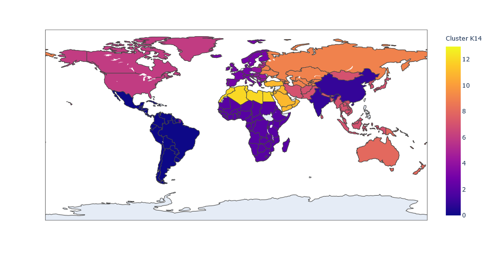

# CIA Country Analysis and Clustering

_In this project, we aim to gain insights into similarities and between countries and regions of the world through exploratory data analysis and by experimenting with different clusters of countries._

* The data set is taken from the CIA World Factbook and contains statistics from over 220 countries (rows); features (columns) include population, land area, birth rate, literary rate, GDP per capita, and other 18 other descriptors
* First, we perform data preprocessing to clean the data set: handled missing data by filling null values with appropriate approximations (e.g., zeroes or region-based means) and converted categories into dummy variables 
* Performed unsupervised machine learning to cluster countries into distinct groups based on the given features, without prior knowledge of group labels: purely exploratory cluster analysis to observe various cluster produced by K-Means clustering with scikit-learn
* Using the elbow method to find, we identified several potential clustering arrangements that could be used to group similar countries together: we identified potential groupings into either 3, 6, or 14 distinct groups based on the elbow method analysis 
* Visualized various clustering results using the plotly library with ISO country codes to generate maps of the world colored by our cluster analysis groupings 

